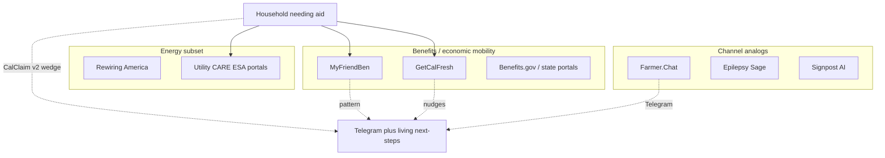

# Competitive UX & traction research (v2)

**Status:** Merged into v2 product framing (2026-07-31)  
**Compiled:** 2026-07-30 · **Rewritten for v2:** 2026-07-31  
**Scope:** Competitive landscape for CalClaim’s **v2 wedge** – Telegram + multi-category financial aid queue + living next-steps + reminders. Energy tools are a **subset** of competitors, not the whole map.

---

## Competitive map (who matters)



---

## A. Primary analogs – multi-benefit last mile

### 1. MyFriendBen

**UX:** Short screener → dollar value + time-to-apply → guidance.  
**Steal:** Ranked value + time; dignified tone; rules-as-code honesty.  
**Don’t clone:** Full multi-state PolicyEngine scale.

### 2. GetCalFresh

**UX:** Mobile-first apply path; reminders; stay until docs/submit.  
**Steal:** Nudges; plain language; completion ownership.  
**Don’t clone:** County submission integration.

### 3. State / federal benefit directories

**UX:** Search → eligibility pages → outbound links.  
**Gap:** No living personal checklist + deadline reminders in chat.

---

## B. Energy subset (still relevant – not the product center)

### Rewiring America / utility portals / rebate aggregators

Useful as **competitors for the energy rows** in CalClaim’s library (CARE, ESA, rebates). They win on discovery and data breadth; they lose on **cross-category completion** and messaging-native checklists.

**v2 implication:** Do not compete on national energy DB breadth. Compete on **multi-aid queue + file + reminders**. A demo that only mirrors RA→PG&E fails v2.

---

## C. Channel / grounding analogs

| Product | Steal for CalClaim v2 |
|---|---|
| Farmer.Chat | Telegram meet-where-they-are; short turns |
| Epilepsy Sage | Frozen library + refuse |
| Signpost AI | Escalation honesty |

**Pattern:**

> Trusted library → constrained ranker → Telegram → Sign up + living file → reminders → escalate when unsure.

**Anti-pattern:** Invent eligibility $; dump only PG&E URLs.

---

## D. CalClaim v2 target CX

**Canonical tree:** [`customer-experience.md`](customer-experience.md).

```text
Telegram /start
  → Opt-in (multi-category aid, not “PG&E upgrades”)
  → Gate: already on Medi-Cal / CalFresh / SSI / CalWORKs / WIC?
  → YES or NO queue (doc-reuse ranked)
  → Offer cards (Sign up / Already / Remind / Skip)
  → Living Application Guide PDF after each action (+ same file at end)
  → Reminders
```

**Demo bar:** &lt;10 minutes to a multi-category next-steps PDF – not a utility form coach.

---

## E. What “better” must mean (v2)

1. **Channel:** Telegram, short bubbles, fixed offer buttons.  
2. **Scope:** Multiple aid categories in one session.  
3. **Completion:** Living file + reminders – not link-out and pray.  
4. **Honesty:** Library-bound $ and deadlines; STOP/erase.  
5. **Dignity:** No shame; plain language.  
6. **Narrow depth &gt; fake national library:** CA English first.

---

## F. Competitive verdict

| Competitor class | Beat them on… | Do not try to beat them on… |
|---|---|---|
| MyFriendBen | Telegram + living PDF + deadline cron | Multi-state rules engine |
| GetCalFresh | Cross-program queue beyond CalFresh | County e-submit |
| Benefits directories | Personal queue + nudges | Being the official eligibility system |
| Rewiring America / utilities | Cross-category completion in chat | Energy data breadth / official enrollment |

---

## Related docs

- [guidelines.md](guidelines.md) – v2 uniqueness bar  
- [finish-line-ux.md](finish-line-ux.md) – living file contract  
- [customer-experience.md](customer-experience.md) – v2 tree  
- [origin-and-reasoning.md](origin-and-reasoning.md) – v1 → v2 pivot  
